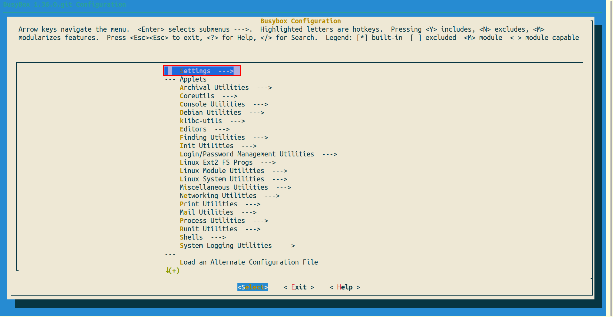

# Building a RISCV Linux kernel and booting it in QEMU inside LXC container  
**Reference links**:  
1. https://risc-v-getting-started-guide.readthedocs.io/en/latest/linux-qemu.html 
2. https://hackernoon.com/how-to-set-up-the-environment-for-riscv-64-linux-kernel-development-in-ubuntu-2004-si5p35kv  

This documentation covers how to build a linux kernel with RISCV linux toolchain inside an un-privileged LXC container and then boot it on qemu.
Doing this process on privileged lxc container makes life easier, but privileged containers always have security loop holes. For instance, their root id is mapped to root id of host machine. On the other hand un-privileged containers are the safest (see [link](https://linuxcontainers.org/lxc/security/)).  
## Machine's and LXC Container's Operating System Specifications
At the time of creating this documentation, following is the specification of host machine and operating system.  
- **Host Machine:** Ubuntu focal (20.04) 64-bit.
- **LXC Container:** Ubuntu jammy (22.04) 64-bit.  
- LXC Container is unprivileged with non-sudo user.  

_**NOTE:** Throughout this documentation, name of the lxc container will be `qemu_container` or `qemucontainer` with non-sudo user as `qemu-user` which is running on ubuntu 22.04 and host machine x86. Do not confuse the name with assumption that it is booting on qemu emulator. It is just a naming convention._  
## Pre-requisites
Following programs may also have their own pre-requisites.  
1. **Git:** For cloning repositories of following programs. Install it with `[sudo] apt install git`.  
2. **TMUX:** For convenience of multiple terminals. Install it using `[sudo] apt install tmux`
3. **RISCV GNU toolchain built as linux:** For compiling the linux kernel.  
4. **Busybox:** For Generating the binaries for linux kernel boot.  
5. **QEMU Emulator:** For booting the linux kernel  
6. **Linux Kernel (latest version which is used at point of writing this documentation is `6.0.0`)**  
  
The working directory inside lxc container for all of this documentation will be `~/riscv-linux` or `/home/qemu-user/riscv-linux`.
  
_**NOTE:** Busybox will not be built inside the lxc container rather it will be built in (any) host linux machine with sudo privileges._

### 3. RISCV GNU Toolchain
- Log in the lxc container to the non-sudo user (here SSH is used to log in).
- Install the prerequisites for building RISCV GNU TOOLCHAIN inside lxc container with `root` user using command below.  
```
apt-get install autoconf automake autotools-dev curl python3 libmpc-dev libmpfr-dev libgmp-dev gawk build-essential bison flex texinfo gperf libtool patchutils bc zlib1g-dev libexpat-dev libncurses-dev
```
- Clone the GNU toolchain using the command below.  
```
git clone https://github.com/riscv-collab/riscv-gnu-toolchain.git
```  
- Create a directory in which the RISCV GNU toolchain is desired to be installed (here it will be `/home/qemu-user/riscv-linux/riscv-gnu-installed`)  
- Execute following command inside cloned repository with `--prefix` as the absolute directory path to where the RISCV toolchain is to be installed
```
./configure --prefix=/home/qemu-user/riscv-linux/riscv-gnu-installed
```
- Execute following inside cloned repository (execution of this command will take a while to complete)
```
make linux -j$(nproc) # 'nproc' is the command used to determine the number of processors in machine so that 'make' can use parallelism.
```
- After the execution of command is complete, add `bin` directory created inside the riscv installation directory to the `$PATH` and add the expression to `.bashrc`. According to this documentation, following expression will be added to `.bashrc`.  
  
`PATH="/home/qemu-user/riscv-linux/riscv-gnu-installed/bin:$PATH"`
  
- Check if the toolchain is installed by executing following commands.
```
exec $SHELL
riscv64-unknown-linux-gnu-gcc
```  
Expected Output:
```
fatal error: no input files
compilation terminated.
```
- Now RISCV linux toolchain is ready !
### 4. Busybox
Busybox is the package for creating linux `binutils` and set of directories for linux to boot into. Busybox will be installed in host machine instead of lxc container. The reason for this is linux kernel requires `block oriented device` and `character oriented device` for it to boot. Those devices can be created using `mknod` command which can only be created inside a host machine with sudo privileges. Busybox will be used in creating initial ram disk file (in gz format) which is used to boot kernel. It does not matter at which operating system or on which machine this file is created. But the machine on which it is compiled, must also have RISCV GNU toolchain installed above.
- Clone Busybox using the command below.
```
git clone https://git.busybox.net/busybox
```
- Navigate to cloned directory.
```
cd busybox
```
- Before building busybox, we need to produce a configuration (.config file) for busybox. It is better to apply default configurations and then change only those which are desired.
```
make ARCH=riscv CROSS_COMPILE=riscv64-unknown-linux-gnu- defconfig
```  
- After the command is executed, a `.config` file will be present in the busybox cloned directory.
- Now, an additional option is to be enabled which enables busybox to build the libraries in the executable instead of separate shared libraries. For this purpose, execute the following command to access the configuration menu. Then go to `Settings` menu by pressing enter and from there, enable `[ ] Build static binary (no shared libs)` by pressing space. After the option is enabled, exit by pressing `esc` twice two times and press yes to the prompt about file saving.
```
make ARCH=riscv CROSS_COMPILE=riscv64-unknown-linux-gnu- menuconfig
```  
  

  

  
- Now that configuration is complete, build busybox by executing following command.  
```
make ARCH=riscv CROSS_COMPILE=riscv64-unknown-linux-gnu- -j$(nproc)
```
- Execute following command which will produce all the basic linux utilities in `_install` directory in `busybox` repo directory.
```
make ARCH=riscv CROSS_COMPILE=riscv64-unknown-linux-gnu- -j$(nproc) install
```
- Navigate to `_install` directory and create `dev` directory.
```
cd _install
mkdir dev
```
- Now, a linux `console` and a `ram` devices are to be created inside `dev` directory. A fact to understand here is that, every device is a file in linux but they are special kind of files. A detail of these devices can be found [here](https://tldp.org/LDP/Linux-Filesystem-Hierarchy/html/dev.html). In this documentation `mknod` command is used to create these devices.  
  
```
sudo mknod dev/console c 5 1
sudo mknod dev/ram b 1 0
```
  
- After executing above commands, following files with names `ram` and `console` will be created as shown in the image below.
  
  
  
- Now an `init` file is needed because linux kernel does not boot itself, it rather searches for `init` file in the directories (read linux kernel messages during build procedure). `init` file contains commands to mount some directories during boot (more information can be found [here](https://tldp.org/LDP/abs/html/systemdirs.html)). In `busybox/_install`, create a file with following contents (be sure to make it executable with `chmod +x init`).  
```
vim init
```
```
#!/bin/sh
echo "### INIT SCRIPT ###"
mkdir /proc /sys /tmp 
mount -t proc none /proc #For processes
mount -t sysfs none /sys #For all the devices on the machine
mount -t tmpfs none /tmp #For virtual memory
echo -e "\nThis boot took $(cut -d' ' -f1 /proc/uptime) seconds\n"
exec /bin/sh
```
- Now that all the files are ready for linux to boot into, pack them in `cpio` format and then to `gz` format. It is because `cpio` format is in "Early userspace support" in linux kernel (see [link](https://docs.kernel.org/driver-api/early-userspace/early_userspace_support.html)) whereas `gz` format is needed because it is one of the formats needed by qemu emulator. Following command produces a qemu-compatible initramfs file for linux kernel to boot in.
```
find -print0 | cpio -0oH newc | gzip -9 > ../initramfs.cpio.gz 
```
  - **Command Details:** 
    - `find -print0` separates the file names with null character
    - `cpio -0oH newc` produces an archive file in `newc` format
    - `gzip -9` creates a gz format zip file. `-9` represents the best compression level at the slowest speed
    - `../initramfs.cpio.gz` represents the output file which is created in parent directory to present working directory.
- At this point, our work with busybox is done.
- Copy the produced file into the lxc container (use `scp` command if it is on ssh).
### 5. QEMU Emulator
- Install the pre-requisites of qemu emulator on lxc container with root user with following command (see [link](https://wiki.qemu.org/Hosts/Linux)).
```
apt-get install git libglib2.0-dev libfdt-dev libpixman-1-dev zlib1g-dev ninja-build
```
- Clone the QEMU Emulator repository using the command below with `root` user:
```
git clone https://github.com/qemu/qemu.git
```
- Build QEMU for RISCV with `root` user using commands below (see [link](https://wiki.qemu.org/Documentation/Platforms/RISCV)).
```
./configure --target-list=riscv64-softmmu
make -j$(nproc)
```
  
- For system-wide installation of QEMU Emulator, run following command with `root` user.
```
make -j$(nproc) install
```
- After execution of this command, work with QEMU Emulator is done and its commands can be accessed anywhere.
## 6. Linux Kernel
- Clone the linux kernel from Linus Torvalds' repository using the command below.
```
git clone https://github.com/torvalds/linux.git
```
- Navigate to cloned repository.
```
cd linux
```
## Building Linux kernel with `riscv64-unknown-linux-gnu-gcc`
- Before building linux kernel with RISCV toolchain a configuration file (.config) must be produced in its directory. First, produce a file with default configurations, then change configurations according to needs.
```
make ARCH=riscv CROSS_COMPILE=riscv64-unknown-linux-gnu- defconfig
make ARCH=riscv CROSS_COMPILE=riscv64-unknown-linux-gnu- menuconfig
```
- Above command will open configuration menu. Enter `General setup`, scroll down and enable  `Initial RAM filesystem and RAM disk (initramfs/initrd) support` using `Space` key. Then enter `()    Initramfs source file(s)` and here put the absolute path to `initramfs.cpio.gz` file which was just created using busybox. For this documentation, it is `/home/qemu-user/riscv-linux/initramfs.cpio.gz`. Double-press `esc` and save the file.
  

  
  
  
  
  
- Now linux kernel is ready to be compiled with `riscv64-linux-gnu-gcc` toolchain. So execute the command below.
```
make ARCH=riscv CROSS_COMPILE=riscv64-unknown-linux-gnu- -j$(nproc)
```
- If the above command successfully executed without any errors, there must be `Kernel: arch/riscv/boot/Image.gz is ready` printed on terminal. On newer linux kernels, it might be scrolled up a little, use `Ctrl-shift-f` to find it.
## Booting into the linux kernel using QEMU emulator
Now that everything is ready, execute the following command in `linux/arch/riscv/boot/` directory to boot linux on `sifive's unleashed`.
```
qemu-system-riscv64 -kernel Image -machine sifive_u -nographic
```
  - **Command Details**
    - `qemu-system-riscv64` is the qemu built for riscv64
    - `-kernel` takes the image produced by linux kernel compilation and is present in `linux/arch/riscv/boot/` directory.
    - `-machine` takes one of the machine names as arguments available in `qemu-system-riscv64`. Available machines can be listed on terminal using command `qemu-system-riscv64 -machine help`.
    - `-nographic` restricts the use of GUI (which is a better option considering lxc container does not support gtk initialization).
- If everything goes on right, the kernel will boot successfully as shown in the picture below.

