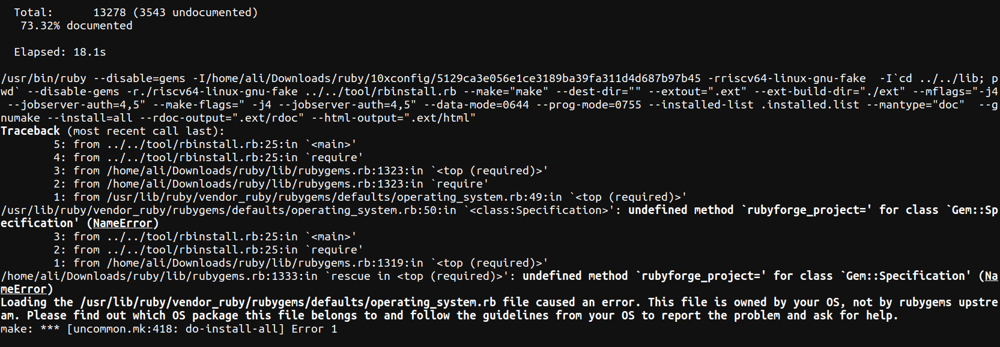
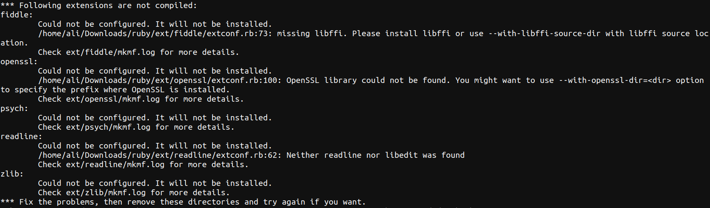

# Cross Compilation of Ruby

## System Specifications

**Build Architecture:** x86_64-linux-gnu  
**Host Architecture:** riscv64-unknown-linux-gnu  
**Operating System for Installation Procedure:** Ubuntu 20.04

## Pre-requisites

Pre-requisites for installing ruby from source can be installed using the following command  

```shell
sudo apt-get -y install libc6-dev libssl-dev libmysql++-dev libsqlite3-dev make build-essential libssl-dev libreadline6-dev zlib1g-dev libyaml-dev
```

Other than this, ruby itself is needed for building ruby from source.

```shell
sudo apt install ruby
```

There is another thing which needs to be taken care of before building ruby from source. If ruby is installed on system itself using `apt`, then cross compiling ruby will end up in an error as shown in the image below. This error is seen in `ruby 2.7.0p0 (2019-12-25 revision 647ee6f091) [x86_64-linux-gnu]`.  

  

To tackle this issue, one workaround is to install build ruby for native system, then delete ruby which was installed through `apt`. This procedure will be added in the `Build` section.

## Getting source code

Source code of ruby can be obtained from github repository using the command below:  

```shell
git clone https://github.com/ruby/ruby.git
```

## Build

### Installing ruby for native architecture

Before cross-compiling, one must install ruby from source on the native machine which will solve the error described in `Pre-requisites` section above.  

- (*THIS STEP IS STRONGLY RECOMMENDED !*)In the source directory, create a folder with any name in which `Makefile` will be generated otherwise there will be a lot of files made in the source directory (possibly create copy of repo directory).  
- In the source directory of ruby run following command to generate `configure` file.  

```shell
./autogen.sh
```  

- After this, run the following `configure` command to generate `Makefile`.  

```shell
../configure --prefix=$PREFIX #$PREFIX is where you want to install binary files at the end, so replace it.
```

- After the above command is completed, run following command to start the build  

```shell
make -j$(nproc) #-j$(nproc) uses parallelism for make
```  

- After the above command is complete, run following command to install the binaries on the specified path mentioned in `--prefix` above  

```shell
make install
```

- Now ruby should be available in the `$PREFIX` path (also in the `.bashrc`). Add $PREFIX path to $PATH variable and uninstall the the ruby installed using `apt` otherwise, the source will keep using that one for building and the error will persist.  

```shell
sudo apt purge ruby
```  

### Cross-Compiling Ruby for `riscv64-unknown-linux-gnu`

- After the ruby installed using `apt` is uninstalled from the system, clean the working directory with following command.  

```shell
make clean
```

- After cleaning the working directory, generate the `Makefile` again for cross-compiling ruby for `riscv64-unknown-linux-gnu` target and host using the command below  

```shell
../../configure --prefix=$PREFIX --build=x86_64-linux-gnu --host=riscv64-unknown-linux-gnu --target=riscv64-unknown-linux-gnu
```

- After the above command is successful, start build with following command  

```shell
make -j(nproc)
```  

- Install the binaries in path mentioned with `--prefix` above with following command  

```shell
make install
```

- After this process, ruby will be installed inside `$PREFIX/` directory.  

**Note:** Currently, this process (as checked on version 3.1.2) installs ruby without extensions shown in the following image  


