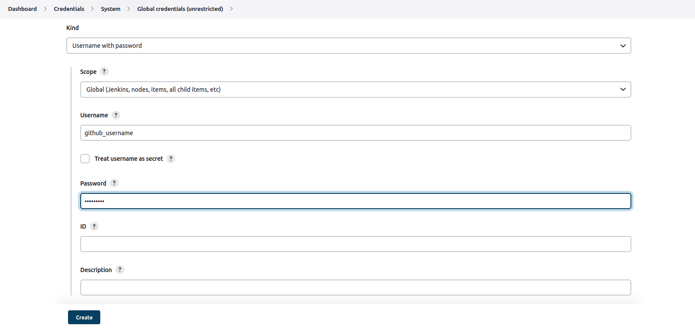

# Software Developer Guide for RISC-V CI

A software developer is the end-user who will develop or build his/her projects on RISC-V CI infrastructure. This guide will cover all the things a software developer needs to create a project based on Cloud-V Continuous Integration (CI).  

## Pre-requisites

1. GitHub account.
2. GitHub project repository with owner rights.

## Getting an account for Cloud-V

Contact us for a new account by emailing us at [cloud-v@10xengineers.ai](mailto:cloud-v@10xengineers.ai) and fill out [this](https://forms.gle/BSRjWqWbB6HNNxxd9) google form.

After this we will get back to you with login credentials.

## Setting up `Jenkinsfile` inside github project repository

Jenkins pipeline will need a `Jenkinsfile` written with jenkins pipeline syntax to start execution of tests/checks (see [link](https://www.jenkins.io/doc/book/pipeline/syntax/)). This pipeline will contain all the stages (and may be steps) of a CI/CD pipeline. This pipeline can be `scripted pipeline` which will only have stages or it can also be `declarative pipeline` which may also have steps inside stages.  

A simple scripted `Helloworld` pipeline in linux is as follows:

```shell

node{
    stage('*** Phase 1 ***') {
        //Using bash commands
        sh '''#!/bin/bash
            echo "Hello World !\n"
         '''
    }
}
```  

Upon execution of such a pipeline, the console output can be viewed as follows.  


_**Note:** This jenkinsfile should remain same in all the branches and pull requests._  

## Setting credentials for webhook

Cloud-V supports webhooks which can trigger the job from external sources such as GitHub. They work in a way such that, if a specified branch is committed or if a pull request is created, the specified job build starts running depending upon the trigger event which is set in build's configuration in Cloud-V.  

This process requires GitHub credentials of owner of repository on which the webhook is to be set. These credentials can be safely added to Cloud-V without anyone (even administrator) seeing the passwords as follows.

### Configuration inside GitHub repository

In GitHub,

- Go to repository settings which you want to integrate for Cloud-V.  


- Go to `Webhooks`  

  

- Click on `Add webhook`  


- Add `Payload URL` as `https://cloud-v.co/ghprbhook/`  
- Select content type as `application/x-www-form-urlencoded`
- Check `Enable SSL verification`  
- In the section **Which events would you like to trigger this webhook?** check `Let me select individual events` and choose the events for which you want build to be triggered.  

Webhook settings will look something like this:

  

### Configurations inside Cloud-V

_**Note:** Currently users are not able to see or modify pipeline build configuration inside Jenkins, that is currently managed by administrator. Users are requested to inform administrator about how they want their pipeline configured._

- We will provide you with Cloud-V credentials on the provided email.
- Login with provided credentials.
- Click on the `Credentials` in the left menu.  


- This will take you to the credentials page.
- Scroll down to the `Stores scoped to Jenkins` and click on the `System` as shown in the image.  

  

- Click on `Global credentials (unrestricted)`.  


- Click on `Add Credentials`.  


- This will take you to the `New Credentials` page.
  - Select `Kind` as `Secret text`.
  - Select `Scope` as `Global (Jenkins, nodes, items, all child items etc)`.
  - Enter `Secret` as `GitHub personal authentication token` (PAT) which can be acquired from Github account settings.  
  - Enter a unique`ID`. `Description` can be left empty. But it is recommended to give a suitable but careful description by which administrator will be able to identify and use these credentials to set up github webhook.
  - Select `Create`.
  - This process will look something like this.

  

- Now credentials will be available in the credentials list and will be shown to you as well as administrator as shown in the image below. This will create an option in configurations for using these credentials in github webhook without changing or viewing them.  

  

- Note the credentials ID (as shown in the image below) and email it to the same administrator email on which you received the credentials. It is important that administrator knows the credentials ID because he will use it in the job build configurations.  

  

_**Note: Please make sure to inform the administrator via email that you have added the credentials in jenkins. Also, send administrator the ID of credentials via email.**_

## Requirements for administrator

After the above setup is complete from software developer's side, developer will need to provide the administrator with following information.  

- Dependencies for running the project which can be packages which are needed to install in the RISC-V CI environment by administrator.
- Events for triggering the job build.
- URL of GitHub repository.
- Path and name of Jenkinsfile on the provided GitHub repository.
- Any additional information which should be given for successful execution of job builds.
