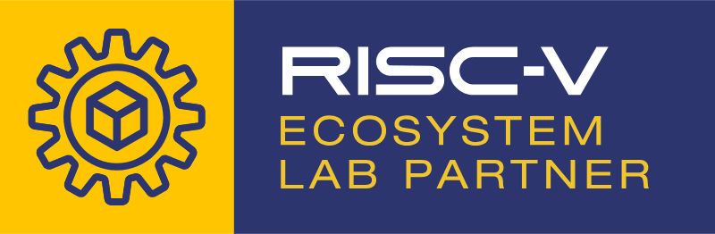

# Cloud-V Documentation

## Overview

Cloud-V is a community platform that accelerates the global adoption of RISC-V ISA by providing free access to RISC-V compute resources for open-source projects worldwide.

**Funded by:** RISE (RISC-V Software Ecosystem) and RISC-V International

## What Cloud-V Offers

Cloud-V provides free access to RISC-V compute machines through following services:

- **CI/CD access** for automated testing and deployment
- **SSH access** to RISC-V compute instances

<!--  -->

    

## RISC-V Ecosystems Lab Partner

Cloud-V is a RISC-V Ecosystem Lab Partner. For more information, visit [https://riscv.org/developers/labs/](https://riscv.org/developers/labs/)

## Getting Started

This documentation provides the tools and information needed to leverage Cloud-V's RISC-V compute instances for your development projects.

## Connect With Us

- **Website:** https://cloud-v.co
- **Discord:** Join the RISC-V Software Ecosystem community at https://discord.gg/H7EGrzV93p
- **YouTube:** [@Cloud-V](https://www.youtube.com/@Cloud-V)
- **Email:** cloud-v@10xengineers.ai
